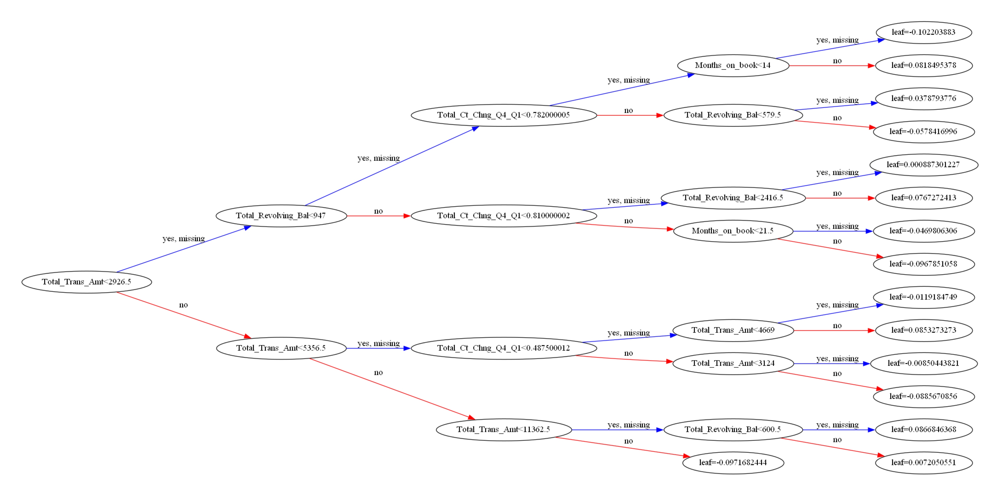

## Machine Learning Part (Classification) :

### Introduction :

ML_Classifier_Sebastien.ipynb notebook is used to make the model and export it as a xgbmodel.bin file, this file can then be used for deployment by the Data Engineer.

### Data cleaning and preprocessing :

A quick EDA was performed on the data, there was no missing values which was a very good starting point.

Then, the features importances was computed on a separated notebook and 11 numerical features were selected to train the model.

These numerical features have some relationship with the categorical values, and thus, the categorical values wasn't selected for final modeling for keeping fitting time as fast as possible.

The two most important features was the total count of transaction, and the total amount transfered by these transactions, which basically give good information about the usage of the card, and thus the likelyhood of a customer to churn...

### Classification model :

The XGBoost classifier was used for this part, it was finetuned with the previously selected features of the dataset to optimise F1 Score to have a good balanced classifying score.

### Dealing with the imbalance of the dataset :

As there was an imbalance in the dataset in the Attrition Flag target, we try various techniques involving resampling (upsampling), with RandomOverSampler and SMOTE, and finally we try to adjust the "scale_pos_weight" of XGBoost. 

After various tests, this last method was finally selected.

In this case, as there was around 16% of churning customer in the dataset, we set the "scale_pos_weight" to the ratio of the number of negative samples to
 the number of positive samples, which in this case is 84/16 = 5.25.

### Model tree export :

To be able to explain how the model is working to a non-tech savvy audience, we decided to export one of the model tree as an example of how the model behave.

