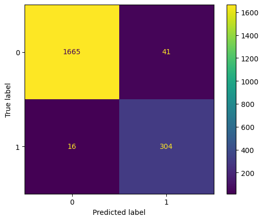
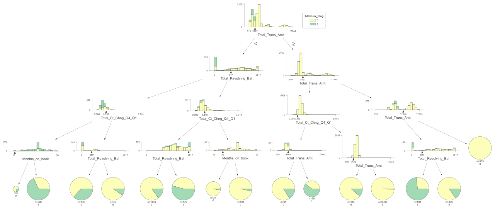

## Machine Learning (Classification) :

### Introduction :

The *ML_Classifier.ipynb* notebook is used to create the model and export it as a xgbmodel.bin file. This file can then be used for deployment by the Data Engineer.

### Data cleaning and preprocessing :

A quick exploratory data analysis was performed on the data, and no missing values were found, which was a very good starting point.

Next, the feature importances were computed in a separate notebook with MLJAR, and 11 numerical features were selected to train the model.

These numerical features have some relationship with the categorical values. Therefore, the categorical values were not selected for the final modeling to keep the fitting time as fast as possible.

The two most important features were the total count of transactions and the total amount transferred by these transactions. These features provide good information about the usage of the card and the likelihood of a customer to churn.

### Classification model :

The XGBoost classifier was used for this part. It was fine-tuned with the previously selected features of the dataset to optimize the F1 Score, resulting in a good balanced classifying score.

F1 Score is the harmonic mean of precision and recall. Precision measures the percentage of correctly predicted positive samples among all predicted positive samples, while recall measures the percentage of correctly predicted positive samples among all actual positive samples.

Therefore, F1 score is a way of summarizing a model's overall performance in terms of correctly identifying positive samples while minimizing false positives and false negatives.

### Dealing with the dataset imbalance :

The Attrition Flag target in the dataset was imbalanced, with the classes not equally represented. The minority class (the attrited ustomer class) had significantly fewer examples than the majority class (the existing customer class). This could cause the model to be biased towards the majority class and perform poorly on the minority class. To address this, various techniques involving resampling (oversampling with RandomOverSampler or SMOTE) and adjusting the `scale_pos_weight` of XGBoost.

After conducting several tests, the `scale_pos_weight` adjustment method was chosen as the most effective solution instead of resampling techniques.

### Further explanation about "scale_pos_weight" :

In XGBoost, `scale_pos_weight` is a hyperparameter that is used to balance the training of the model for imbalanced classification problems.

The `scale_pos_weight` parameter allows the user to adjust the balance between the positive and negative classes during training by assigning a weight to the positive class. This weight is used to increase the contribution of the positive class to the loss function during training. The higher the weight, the more importance is given to the positive class, and the better the model will be at predicting it.

In this case, as there was around 16% of churning customer in the dataset, we set the `scale_pos_weight` to the ratio of the number of negative samples to the number of positive samples, which in this case is 84/16 = 5.25. This will increase the weight of the positive class by a factor of 5.25, making it more important during training.

In summary, `scale_pos_weight` is a hyperparameter that is used to balance the classes during training for imbalanced classification problems by assigning a weight to the positive class.

### Model metrics :

#### Confusion Matrix :

#### Classification Report :

|                       | Precision      | Recall       | F1-Score      | Support      |
|:--------------------- |:--------------:|:------------:|:-------------:|:------------:|
| Class 0               | 99 %           | 98 %         | 98 %          | 1706         |
| Class 1               | 88 %           | 95 %         | 91 %          | 320          |
| --------------------- | -------------- | ------------ | ------------- | ------------ |
| **Accuracy**          | -              | -            | 97 %          | 2026         |
| **Macro avg**         | 94 %           | 96 %         | 95 %          | 2026         |
| **Weighted avg**      | 97 %           | 97 %         | 97 %          | 2026         |

### Exporting the model tree :

In order to provide a simple explanation of how the model is working, we utilized dtreeviz to export one of the model trees as an example. This allowed us to present the decision-making process of the model in a clear and understandable manner.

